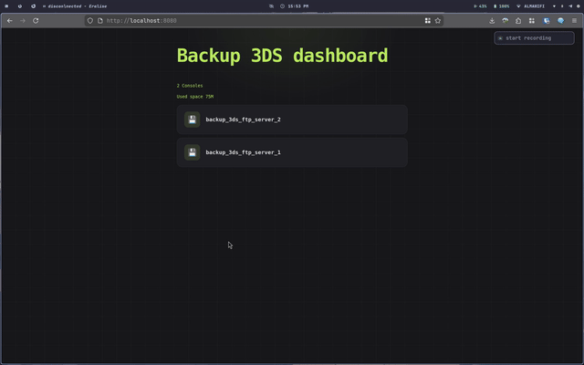

# Backup 3DS

Make backups of 3ds using ftpd periodically, all in docker container 🐳



## Features

- **Automated Backups**: Uses cron to run a backup script
- **FTP-Based Transfer**: data are copied from the 3DS via ftp exposed by [FTPD](https://github.com/mtheall/ftpd)
- **Docker Containerized**: Easy deployment with Docker and Docker Compose
- **Low Maintenance**: Set it and forget it - backups run automatically in the background
- **Very ugly dashboard**: Static web interface to download backups

## Prerequisites

Before using this backup solution, ensure you have:

- A Nintendo 3DS with [FTPD](https://github.com/mtheall/ftpd) installed and running
- Docker and Docker Compose installed on your system
- Your 3DS and backup server on the same local network
- The IP address and port of your 3DS FTPD server

## Installation

### Using Docker Compose

Just copy and paste this compose file and customize variables and mountpoints as needed

```yaml
---
services:
  backup_3ds:
    container_name: backup_3ds
    image: carnivuth/backup_3ds:latest
    environment:
      - FTPD_3DS_ADDRESSES=insert your 3DS ip addresses separated by ;
      # to enable dashboard add this
      #- ENABLE_DASHBOARD=true
    volumes:
      # where backups are stored
      - "your data directory:/var/lib/backup_3ds"
```

### Using Docker Run

Alternatively, you can run the container directly with Docker:

```bash
docker run -d \
  --name backup_3ds \
  -e FTPD_3DS_ADDRESSES=192.168.1.XXX \
  -v ./data:/var/lib/backup_3ds \
  carnivuth/backup_3ds:latest
```

## Configuration

### Environment Variables

The following environment variables are used to configure the backup container:


| Variable | Description | Default Value | Required |
|----------|-------------|---------------|----------|
| `FTPD_3DS_ADDRESSES` | List of the IP addresses of your Nintendo 3DS running FTPD separated by `;` | None | Yes |
| `FTPD_3DS_PORT` | List of ports that FTPD is listening on, one for each 3DS configured i `FTPD_3DS_ADDRESSES` | `21` | No |
| `FTPD_3DS_USERNAMES` | List of ftp usernames used to authenticate to the 3DS, one for each 3DS configured i `FTPD_3DS_ADDRESSES` | None | No |
| `FTPD_3DS_PASSWORDS` | List of ftp password used to authenticate to the 3DS, one for each 3DS configured i `FTPD_3DS_ADDRESSES` | None | No |
| `BACKUP_DIRS` | List of paths to backup from the 3ds separated by `;`, for example to backup [checkpoint](https://github.com/BernardoGiordano/Checkpoint/releases) data and saves from nds games saved in `saves` directory `/3ds/Checkpoint/saves;/roms/nds/saves` (assuming nds roms are saved under `/roms/nds`)  | `/` | No |
| `ENABLE_DASHBOARD` | Enable dashboard (start lighttpd inside docker container), enable by setting to `ENABLE_DASHBOARD=true`  | None | No |


### Finding Your 3DS FTPD Information

To find your 3DS IP address and port:

1. Launch FTPD on your Nintendo 3DS
2. On the top screen, you'll see:
   - **IP Address** (highlighted in blue) - Use this for `FTPD_3DS_ADDRESSES`
   - **Port** (highlighted in red) - Use this for `FTPD_3DS_PORTS`
3. Keep FTPD running on your 3DS while backups are being performed

**Note**: Ensure your 3DS and the Docker host are on the same local network.

### Change default backup schedule

The backup schedule is controlled by the `crontab` file in the container. By default, backups run periodically based on the cron configuration. To customize the backup schedule, you can:

1. Mount a custom `crontab` file as a volume in `/etc/crontab`

## Troubleshooting

### FTPD Not Responding

- FTPD on 3DS may timeout after inactivity - restart it before scheduled backups
- Some routers assign different IPs - consider setting a static IP for your 3DS

### Permission Issues

If you encounter permission errors with the backup directory:

```bash
sudo chown -R $(id -u):$(id -g) ./YOUR-DATA-DIR
```

## License

This project is open source. Please check the repository for license information.

## Acknowledgments

- [FTPD](https://github.com/mtheall/ftpd) by mtheall - FTP Server for 3DS/Switch
- The Nintendo 3DS homebrew community
