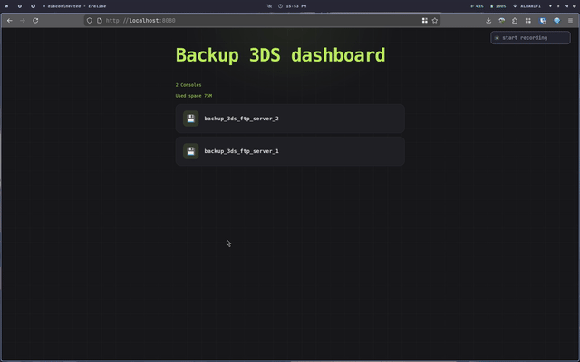

# Console Backupper

Make backups of modded consoles using ftp, all in docker container 🐳



## Features

- **Automated Backups**: search for active consoles and tries to backup them
- **FTP-Based Transfer**: data are copied from the consoles via ftp
- **Automated pruning of old backups**: data are pruned periodically based on [configuration parameters](#Configuration-parameters)
- **Docker Containerized**: Easy deployment with Docker and Docker Compose
- **Low Maintenance**: Set it and forget it - backups run automatically in the background
- **Very ugly dashboard**: Static web interface to download backups

## Installation

### Using Docker Compose

Just copy and paste this compose file and customize variables and mountpoints as needed

```yaml
---
services:
  console_backupper:
    container_name: console_backupper
    image: carnivuth/console_backupper:latest
    environment:
      # to enable dashboard add this
      #- ENABLE_DASHBOARD=true
    volumes:
      # where backups are stored
      - "your data directory:/var/lib/console_backupper/"
      - "your cache directory:/var/cache/console_backupper/"
      - "your configuration file :/etc/console_backupper/config.yml:ro"
```

- configuration file sample:

```yaml
---
consoles:
  - name: my.psvita.local
    port: 1337
    # optionally set user and password
    # user: user
    # password: password
    dirs:
      - ux0:/pspemu/PSP/SAVEDATA
  - name: my.3ds.local
    port: 5000
    dirs:
      - /3ds/Checkpoint/saves
      - /roms/nds/saves
```

### Using Docker Run

Alternatively, you can run the container directly with Docker:

```bash
docker run -d \
  --name console_backupper \
  -v ./data:/var/lib/console_backupper \
  -v ./cache:/var/cache/console_backupper \
  -v ./config.yml:/etc/console_backupper/config.ymlc\
  carnivuth/console_backupper:latest
```

## License

This project is open source. Please check the repository for license information.

## Acknowledgments

- [FTPD](https://github.com/mtheall/ftpd) by mtheall - FTP Server for 3DS/Switch
- The Nintendo 3DS homebrew community
